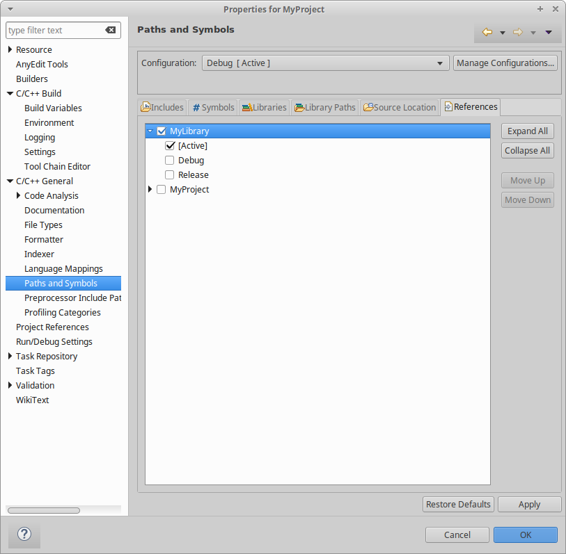
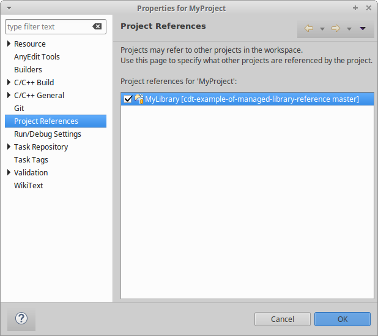
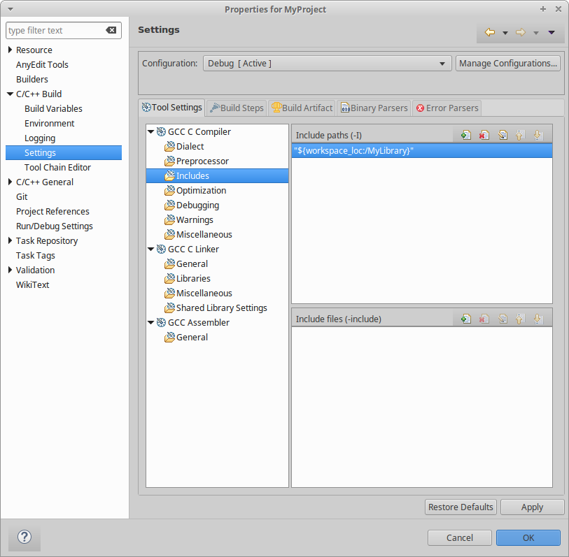
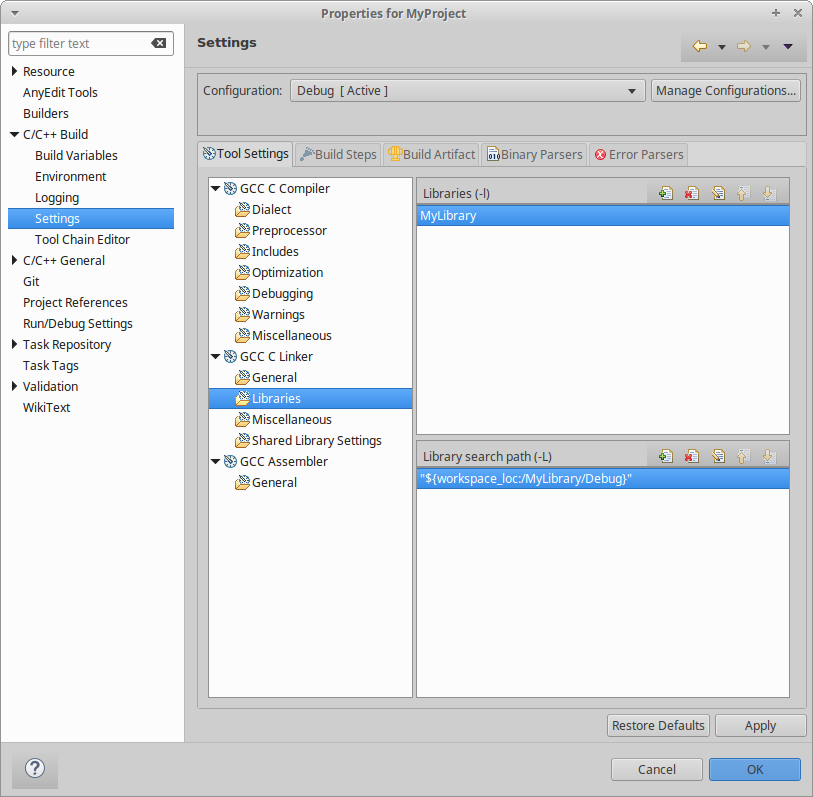
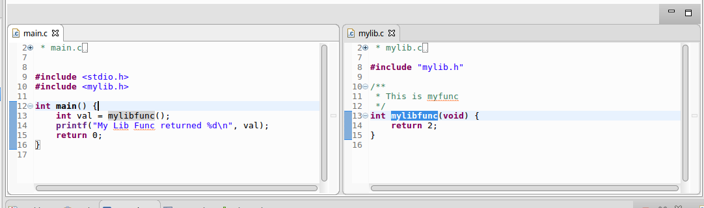

# CDT Example of Managed Library References

Originally created to answer https://www.eclipse.org/forums/index.php/mv/msg/1082837/1749004/#msg_1749004

To setup a referenced project in CDT Managed Make:

1. Create a Static Library in the new C Project Wizard
2. Create a Executable project in the new C Project Wizard
3. In the Executable project, open project settings -> C/C++ General -> Paths and Symbols
4. Goto References tab
5. Check the reference you want (like this picture)



The above will automatically 

- set/manage the Project References, like this:



- set the include paths like this:



- set the library paths and names like this:



So the result is when you run a build everything is picked up as expected, and CDT's indexer understands too. Import the projects in this repo (Linux GCC) for an example.


CDT Indexer operating as expected (Ctrl-click on mylibfunc() in main.c leads to library file:



Expected build output (from CDT Global Build Console):

```
21:56:40 **** Build of configuration Debug for project MyLibrary ****
make all 
Building file: ../mylib.c
Invoking: GCC C Compiler
gcc -O0 -g3 -Wall -c -fmessage-length=0 -MMD -MP -MF"mylib.d" -MT"mylib.o" -o "mylib.o" "../mylib.c"
Finished building: ../mylib.c
 
Building target: libMyLibrary.a
Invoking: GCC Archiver
ar -r  "libMyLibrary.a"  ./mylib.o
ar: creating libMyLibrary.a
Finished building target: libMyLibrary.a
 

21:56:40 Build Finished (took 64ms)

21:56:40 **** Build of configuration Debug for project MyProject ****
make all 
Building file: ../main.c
Invoking: GCC C Compiler
gcc -I"/home/jonah/git/cdt-example-of-managed-library-reference/MyLibrary" -O0 -g3 -Wall -c -fmessage-length=0 -MMD -MP -MF"main.d" -MT"main.o" -o "main.o" "../main.c"
Finished building: ../main.c
 
Building target: MyProject
Invoking: GCC C Linker
gcc -L"/home/jonah/git/cdt-example-of-managed-library-reference/MyLibrary/Debug" -o "MyProject"  ./main.o   -lMyLibrary
Finished building target: MyProject
 

21:56:40 Build Finished (took 115ms)
```


